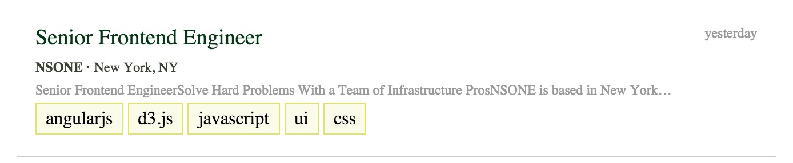

# Fresh Job Board Components

## Description
Build out data driven components for the Fresh Job Board

## Objectives

### Learning Objectives

After completing this assignment, you should…

* Understand how to pass data into react components

### Performance Objectives

After completing this assignment, you be able to effectively use

* React / JSX properties

## Details

### Deliverables

* A repo containing at least:
  * `scripts/main.js`
  * `scripts/models/CompanyModel.js`
  * `scripts/models/JobModel.js`
  * `styles/main.scss`
  * `index.html`

### Requirements

* No ESLint warnings or errors

## Normal Mode
Using the data models that you mapped out in the [fresh job board models](https://github.com/TIY-Austin-Front-End-Engineering/fresh-job-board-models) assignment, create matching Backbone models and collections.

Next implement the job row component below:

All of the data that is shown in the row (job title, company, city, description, tags) should be read from your backbone model. If the model changes the component should re-render (hint: you will need to use an event listener and `this.forceUpdate` within your component).

Next implement the company box component below:

All of the data that is shown in the box (company name, logo, background image, and company size) should be read from your backbone model. If the model changes the component should re-render (hint: you will need to use an event listener and `this.forceUpdate` within your component).

## Notes

To test if your component is working you will need to create some example companies and pass them in to your component via component properties.

## Additional Resources

* Read 
